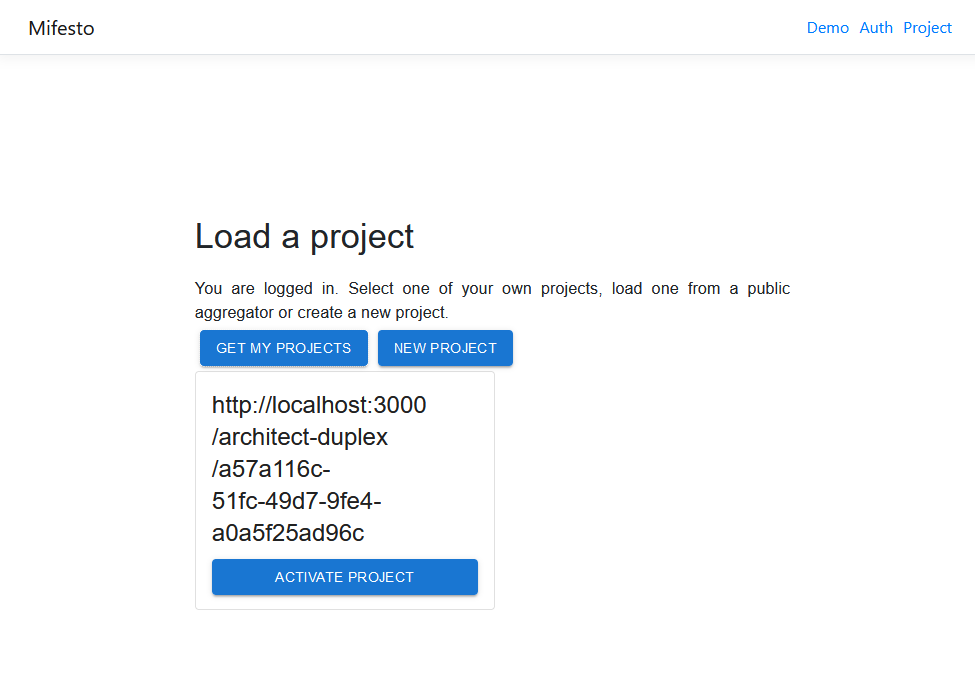

# Mifesto: Project Page
This is a micro-frontend module that provides a page that can be used to load the [ConSolid](https://content.iospress.com/articles/semantic-web/sw233396) projects a user participates in. The page is prototypical and only intended as a proof-of-concept. Upon loading a project, the module will load the RDF metadata of the project into a local triple store. This allows for more efficient querying of the project and the sub-document references it contains. 

## About Mifesto
Mifesto (Micro-Frontend Store) is an experimental framework for federation of micro-frontends. It is a work in progress and is not yet ready for production use. Micro-frontend modules expose the following: 

* a manifest file that describes the module and its dependencies
* loadable code which may be injected into a "bundler" application

The bundler application is responsible for loading the micro-frontend modules and providing a framework for them to interact with each other. The bundler application is also responsible for providing an interface for the micro-frontend modules to render into. Mifesto modules may or may not be compatible with the [ConSolid ecosystem](https://content.iospress.com/articles/semantic-web/sw233396), or generally with AEC multi-models. To be useful for interacting with multi-models, a minimal functionality is required. This functionality is described in the [Mifesto documentation]().